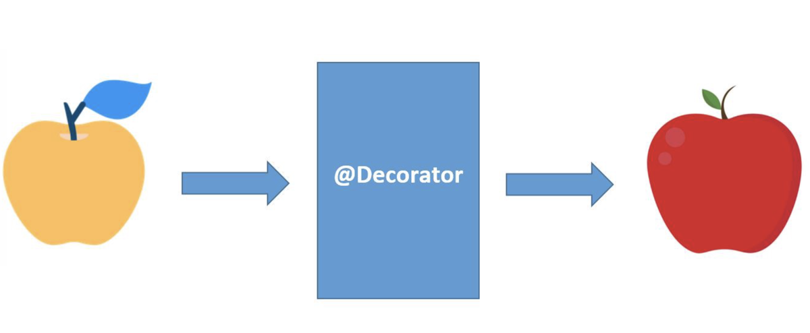

# Decorators

Библиотека `decorators` предоставляет обширный набор готовых декораторов Python для решения повседневных задач: логирование, кэширование, измерение времени, обработка ошибок, повторные попытки и многое другое.



## Install

### Python
```bash
pip install --upgrade git+https://github.com/ParkhomenkoDV/decorators.git@main
```

## Usage

### @timeit

```python
from decorators import timeit
import time

@timeit(rnd=3)
def slow_function():
    time.sleep(1.5)
    return "Готово"

result = slow_function()
# Вывод: "slow_function" elapsed 1.501 seconds (жёлтым цветом)
```

## Profiling

```python
if __name__ == "__main__":
    import cProfile
    cProfile.run("test()", sort="cumtime")
```